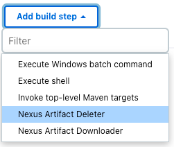
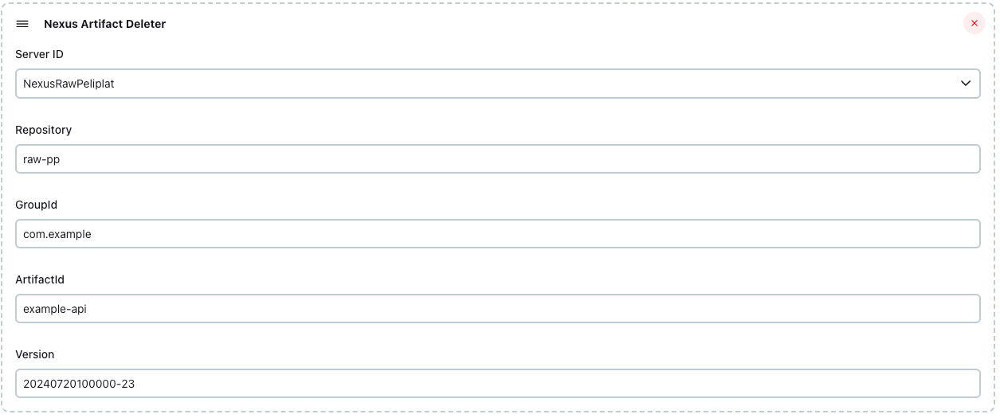
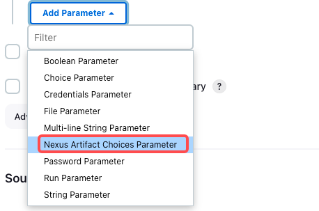
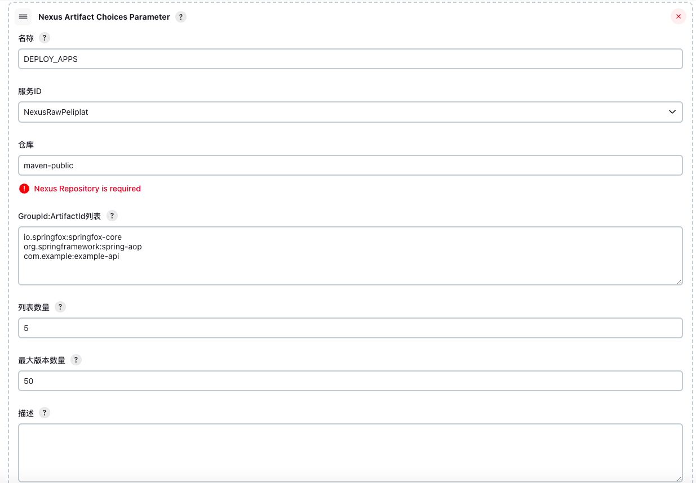
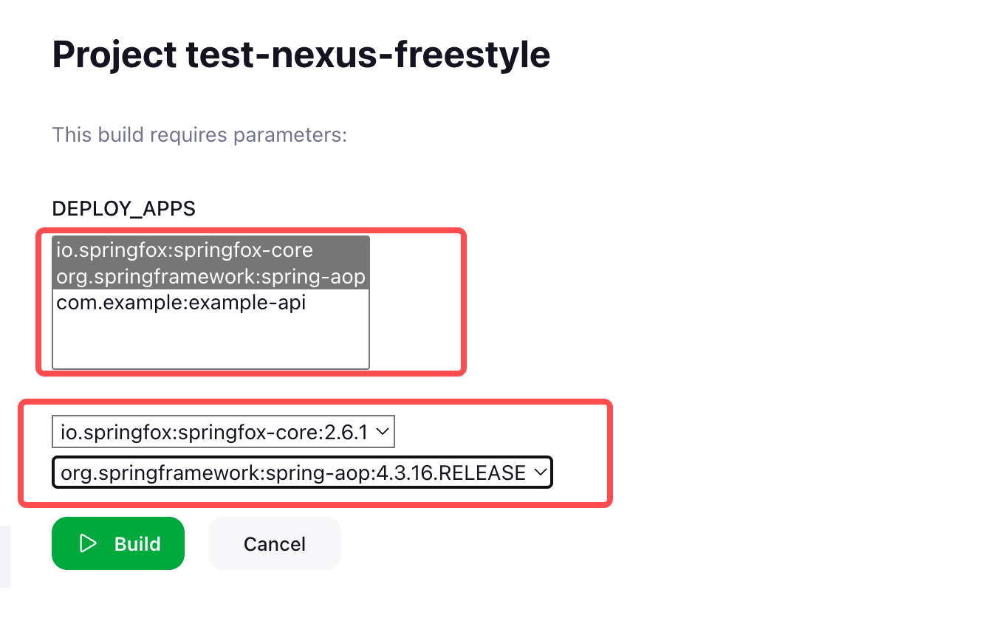
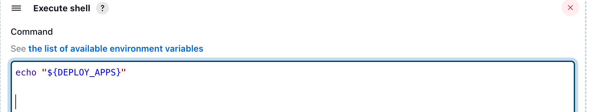
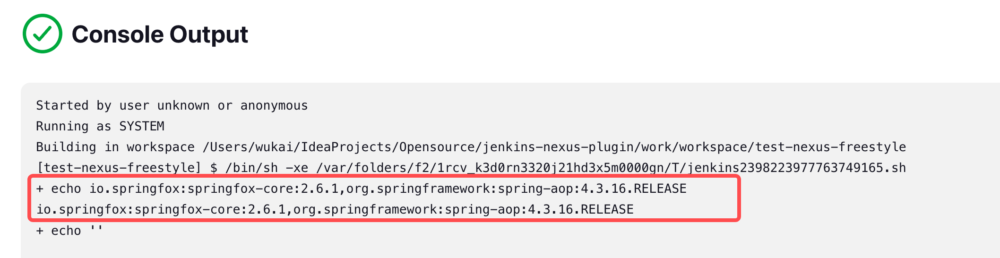

# Jenkins Nexus Plugin

## Introduction

Use the Nexus 3 repository service for artifact management. This plugin only supports Nexus 3.x versions.

## Features

- nexusArtifactPublish: Upload the built artifacts to the Nexus repository service.
- nexusArtifactDownload: Download artifacts from the Nexus repository service. 
- nexusArtifactDelete: Delete artifacts from the Nexus repository service.
- nexusArtifactChoices: List of Nexus repository artifact parameters.

## Usage

### Global Configuration

| Parameter     | Parameter name | Parameter description             |
|---------------|----------------|-----------------------------------|
| serverId      | Server ID      | Nexus Server ID                   |
| serverUrl     | Server URL     | Nexus ServerURL                   |
| credentialsId | Credentials    | Nexus Access Credentials ID       |
| displayName   | Display Name   | Display Name                      |
| docker        | Docker         | Weather is this a Docker registry |

In Jenkins, go to Manage Jenkins → Nexus and configure the Nexus service credentials and endpoint.


### nexusArtifactPublish

| Parameter      | Parameter name | Parameter description                            | Required |
| ------- |--|--------------------------------------------------|----------|
| serverId   | Server ID | The ID defined in the global configuration       | Y        |
| repository   | Repository | Repository                                       | Y        |
| groupId   | GroupId | Group ID                                         | Y        |
| artifactId   | ArtifactId | Artifact ID                                      | Y        |
| version   | Version | Version                                          | Y        |
| generatePom   | Generate Pom | Weather generate maven pom file (Only used in maven2 repo) | N        |
| packing   | Packing | Maven packing format (only used in maven2 repo）  | N        |
| includes | Include Files | Include files，`dist/**`   `target/**.jar`        | Y        |
| excludes | Excludes Files | Execlude files，`*.svg,*.png`                     | N        |

> Tip：Supports publishing artifacts to Nexus repositories in raw and maven2 formats.

#### Freestyle job

In Add post-build action, select Nexus Artifact Publisher.


Provide configuration details:


#### Pipeline job

``` groovy
pipeline {
    agent any
    stages {
        stage('Hello') {
            steps {
                sh '''
                mkdir -p test
                echo "Hello world" > test/test.txt
                echo "foo: bar" > deploy.yaml
                tar -czf test.tar.gz -C test .
                '''
                nexusArtifactPublish(
                        serverId: 'nexus-raw',
                        repository: 'raw-pp',
                        groupId: 'com.example',
                        artifactId: 'example-api',
                        version: '1.0-SNAPSHOT',
                        includes: '*.tar.gz,*.yaml',
                        excludes: '*.png')
            }
        }
    }
}
```

### nexusArtifactDownload

| Parameter         | Parameter name     | Parameter description         | Required |
|------------|----------|------------------------|----------|
| serverId   | Server ID | The ID defined in the global configuration | Y        |
| repository | Repository | Repository                   | Y        |
| groupId    | GroupId  | Group ID               | Y        |
| artifactId | ArtifactId |  Artifact ID           | Y        |
| version    | Version  |  Version               | Y        |
| location   | Location | Local download path. If left empty, the default is the root of the workspace. If it is a directory, it must end with a ‘/’. | N        |

> Tip：Supports downloading artifacts from Nexus repositories in raw and maven2 formats.

#### Freestyle job

In Add build step, select Nexus Artifact Downloader.


Provide configuration details:


#### Pipeline job

```groovy
pipeline {
    agent any
    stages {
        stage('Hello') {
            steps {
                nexusArtifactDownload(
                        serverId: 'nexus-raw',
                        repository: 'raw-pp',
                        groupId: 'com.example',
                        artifactId: 'example-api',
                        version: '1.0-SNAPSHOT',
                        location: 'example/')
                sh 'ls -hl'
            }
        }
    }
}
```

### nexusArtifactDelete

| Parameter         | Parameter name      | Parameter description | Required |
|------------|----------|-----------------------|----|
| serverId   | Server ID | The ID defined in the global configuration                      | Y  |
| repository | Repository | Repository                  | Y  |
| groupId    | GroupId  | Group ID              | Y  |
| artifactId | ArtifactId | Artifact ID           | Y  |
| version    | Version  | Version               | Y  |

> Tip：Supports deleting artifacts from Nexus repositories in raw and maven2 formats.

#### Freestyle job

In Add build step, select Nexus Artifact Deleter。



Provide configuration details:



#### Pipeline job

```groovy
pipeline {
    agent any
    stages {
        stage('Hello') {
            steps {
                nexusArtifactDelete(
                        serverId: 'nexus-raw',
                        repository: 'raw-pp',
                        groupId: 'com.example',
                        artifactId: 'example-api',
                        version: '1.0-SNAPSHOT')
            }
        }
    }
}
```

### nexusArtifactChoices

| Parameter         | Parameter name                                                                | Parameter description                                                                                                                                     | Required |
|----------|-------------------------------------------------------------------------------|-----------------------------------------------------------------------------------------------------------------------------------------------------------|----|
| name     | Name                                                                          | The param name                                                                                                                                            | Y  |
| serverId | Server ID                                                                     | The ID defined in the global configuration                                                                                                                | Y  |
| repository | Repository                                                                    | Repository                                                                                                                                                | Y  |
| groupIdArtifactIds  | GroupId:ArtifactId:[:VersionFilter] (GroupId:ArtifactId[:VersionFilter] List) | Artifact list format: GroupId:ArtifactId[:VersionFilter]. The VersionFilter supports wildcard matching. Multiple entries should be separated by new lines. | Y  |
| visibleItemCount  | Visible Item Count                                                            | Number of items display in the GroupId:ArtifactId[:VersionFilter] list                                                                                    | Y  |
| maxVersionCount  | Max Version Count                                                             | Max number of version                                                                                                                                | Y  |

> Tip：Supports choosing artifacts from Nexus repositories in raw and maven2 formats.

Check `This project is parameterized`, then select `Nexus Artifact Choices Parameter`:




Provide configuration details:



After running the pipeline, it will download the versions under the specified groupId-artifactId, display them in a list, and allow you to select the artifact version. The selected version will be stored in the environment variable named by the name parameter.




