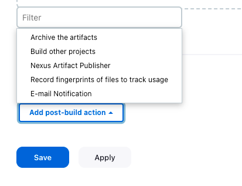
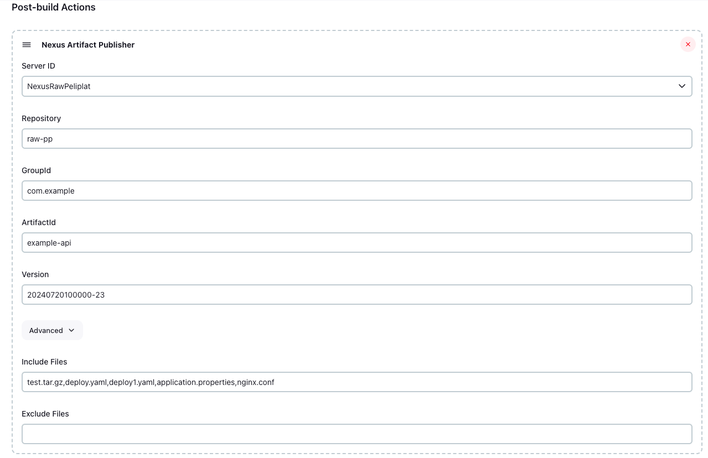
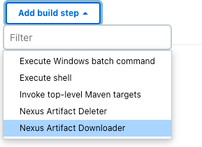
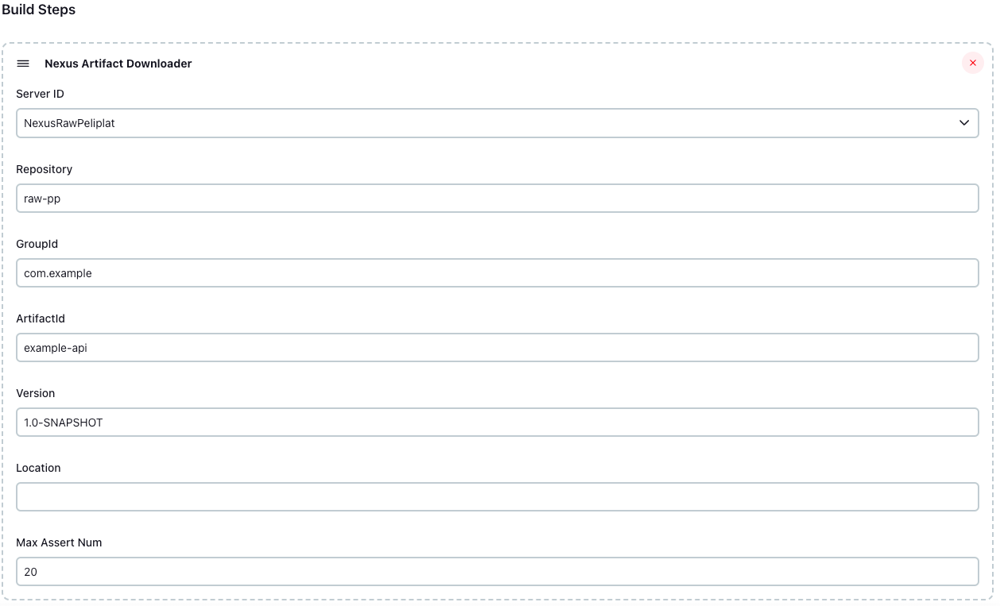

# Jenkins Nexus Plugin

## 介绍

使用 Nexus3 仓库服务做制品管理。此插件仅支持 Nexus-3.x 版本，制品管理目前只支持 maven2 和 raw 类型的仓库。

## 特性

- nexusArtifactPublish: 将构建后的制品上传到 Nexus 仓库服务。
- nexusArtifactDownload: 从 Nexus 仓库服务下载制品。 
- nexusArtifactDelete: 从 Nexus 仓库服务删除制品。
- nexusArtifactChoices: Nexus 仓库制品参数列表。

## 使用

### 全局配置

| 参数            | 参数名称 | 参数解释                        |
|---------------|---|-----------------------------|
| serverId      | Server ID | Nexus 服务ID                  |
| serverUrl     | Server URL | Nexus 服务地址                  |
| credentialsId | Credentials | Nexus 服务访问凭据ID              |
| displayName   | Display Name  | 展示名称                        |

在Jenkins系统管理 -> Nexus，配置 Nexus 服务访问凭证和地址。


### nexusArtifactPublish

| 参数       | 参数名称 | 参数解释                   | 必填 |
| ---------- |--|------------------------|----|
| serverId      | Server ID | 全局配置中的Nexus ID         | Y  |
| repository      | Repository | 仓库名称                   | Y  |
| groupId      | GroupId | Group ID               | Y  |
| artifactId      | ArtifactId |  Artifact ID           | Y  |
| version      | Version |  Version               | Y  |
| generatePom      | Generate Pom | 是否生成pom文件（maven2仓库可用）  | N  |
| packing      | Packing | 全局配置中的Nexus ID（maven2仓库可用） | N  |
| includes   | Include Files | 包含文件，`dist/**`   `target/**.jar` | Y  |
| excludes   | Excludes Files | 排除文件，`*.svg,*.png`     | N |

#### Freestyle 作业

在 Add post-build action（增加构建后操作步骤）选择 Nexus Artifact Publisher。



配置参数。



#### Pipeline 作业

``` groovy
pipeline {
    agent any
    stages {
        stage('Hello') {
            steps {
                sh '''
                mkdir -p test
                echo "Hello world" > test/test.txt
                echo "foo: bar" > deploy.yaml
                tar -czf test.tar.gz -C test .
                '''
                nexusArtifactPublish(
                        serverId: 'nexus-raw',
                        repository: 'raw-pp',
                        groupId: 'com.example',
                        artifactId: 'example-api',
                        version: '1.0-SNAPSHOT',
                        includes: '*.tar.gz,*.yaml',
                        excludes: '*.png')
            }
        }
    }
}
```

### nexusArtifactDownload

| 参数         | 参数名称     | 参数解释                   | 必填 |
|------------|----------|------------------------|----|
| serverId   | Server ID | 全局配置中的Nexus ID         | Y  |
| repository | Repository | 仓库名称                   | Y  |
| groupId    | GroupId  | Group ID               | Y  |
| artifactId | ArtifactId |  Artifact ID           | Y  |
| version    | Version  |  Version               | Y  |
| location   | Location | 本地的下载位置，不填默认在workspace根目录，如果是文件夹必须以'/'结尾 | N |

#### Freestyle 作业

在 Add build step（增加构建步骤）选择 Nexus Artifact Downloader。



填写配置。



#### Pipeline 作业

```groovy
pipeline {
    agent any
    stages {
        stage('Hello') {
            steps {
                nexusArtifactDownload(
                        serverId: 'nexus-raw',
                        repository: 'raw-pp',
                        groupId: 'com.example',
                        artifactId: 'example-api',
                        version: '1.0-SNAPSHOT')
                sh 'ls -hl'
            }
        }
    }
}
```

