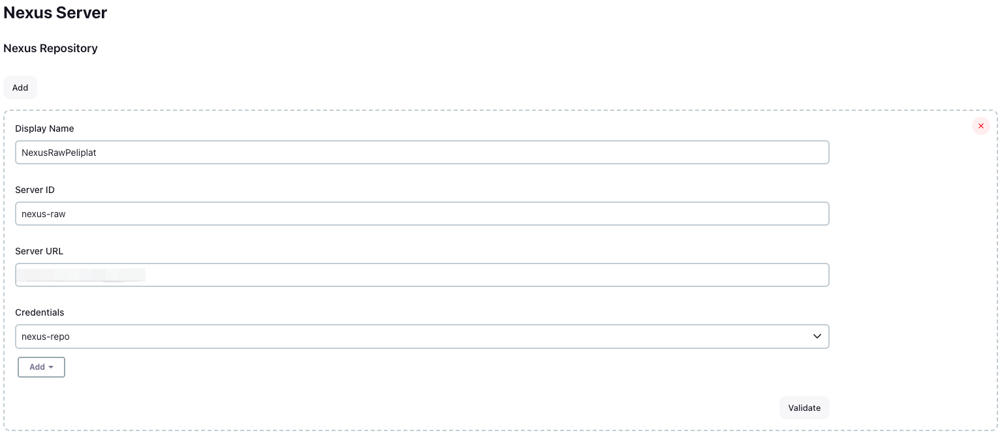

# Jenkins Nexus Plugin

## 介绍

使用 Nexus3 仓库服务做制品管理。此插件仅支持 Nexus-3.x 版本。

## 特性

- nexusArtifactPublish: 将构建后的制品上传到 Nexus 仓库服务。
- nexusArtifactDownload: 从 Nexus 仓库服务下载制品。 
- nexusArtifactDelete: 从 Nexus 仓库服务删除制品。
- nexusArtifactChoices: Nexus 仓库制品参数列表。

## 使用

### 全局配置

| 参数            | 参数名称         | 参数解释           |
|---------------|--------------|----------------|
| serverId      | Server ID    | Nexus 服务ID     |
| serverUrl     | Server URL   | Nexus 服务地址     |
| credentialsId | Credentials  | Nexus 服务访问凭据ID |
| displayName   | Display Name | 展示名称           |
| docker        | Docker       | 是否是Docker仓库地址  |

在Jenkins系统管理 -> Nexus，配置 Nexus 服务访问凭证和地址。



### nexusArtifactPublish

| 参数       | 参数名称 | 参数解释                   | 必填 |
| ---------- |--|------------------------|----|
| serverId      | Server ID | 全局配置中的Nexus ID         | Y  |
| repository      | Repository | 仓库名称                   | Y  |
| groupId      | GroupId | Group ID               | Y  |
| artifactId      | ArtifactId |  Artifact ID           | Y  |
| version      | Version |  Version               | Y  |
| generatePom      | Generate Pom | 是否生成pom文件（maven2仓库可用）  | N  |
| packing      | Packing | 全局配置中的Nexus ID（maven2仓库可用） | N  |
| includes   | Include Files | 包含文件，`dist/**`   `target/**.jar` | Y  |
| excludes   | Excludes Files | 排除文件，`*.svg,*.png`     | N |

> Tip：目前仅支持往 Nexus`raw`和`maven2（release）`格式，`hosted`类型的仓库上传制品。

#### Freestyle 作业

在 Add post-build action（增加构建后操作步骤）选择 Nexus Artifact Publisher。


配置参数。


#### Pipeline 作业

``` groovy
pipeline {
    agent any
    stages {
        stage('Hello') {
            steps {
                sh '''
                mkdir -p test
                echo "Hello world" > test/test.txt
                echo "foo: bar" > deploy.yaml
                tar -czf test.tar.gz -C test .
                '''
                nexusArtifactPublish(
                        serverId: 'nexus-raw',
                        repository: 'raw-pp',
                        groupId: 'com.example',
                        artifactId: 'example-api',
                        version: '1.0-SNAPSHOT',
                        includes: '*.tar.gz,*.yaml',
                        excludes: '*.png')
            }
        }
    }
}
```

### nexusArtifactDownload

| 参数         | 参数名称     | 参数解释                   | 必填 |
|------------|----------|------------------------|----|
| serverId   | Server ID | 全局配置中的Nexus ID         | Y  |
| repository | Repository | 仓库名称                   | Y  |
| groupId    | GroupId  | Group ID               | Y  |
| artifactId | ArtifactId |  Artifact ID           | Y  |
| version    | Version  |  Version               | Y  |
| location   | Location | 本地的下载位置，不填默认在workspace根目录，如果是文件夹必须以'/'结尾 | N |

> Tip：支持从 Nexus`raw`和`maven2`格式的仓库下载制品。

#### Freestyle 作业

在 Add build step（增加构建步骤）选择 Nexus Artifact Downloader。


填写配置。


#### Pipeline 作业

```groovy
pipeline {
    agent any
    stages {
        stage('Hello') {
            steps {
                nexusArtifactDownload(
                        serverId: 'nexus-raw',
                        repository: 'raw-pp',
                        groupId: 'com.example',
                        artifactId: 'example-api',
                        version: '1.0-SNAPSHOT',
                        location: 'example/')
                sh 'ls -hl'
            }
        }
    }
}
```

### nexusArtifactDelete

| 参数         | 参数名称     | 参数解释                   | 必填 |
|------------|----------|------------------------|----|
| serverId   | Server ID | 全局配置中的Nexus ID         | Y  |
| repository | Repository | 仓库名称                   | Y  |
| groupId    | GroupId  | Group ID               | Y  |
| artifactId | ArtifactId |  Artifact ID           | Y  |
| version    | Version  |  Version               | Y  |

> Tip：支持删除 Nexus`raw`和`maven2`格式仓库下的制品。

#### Freestyle 作业

在 Add build step（增加构建步骤）选择 Nexus Artifact Deleter。


填写配置。


#### Pipeline 作业

```groovy
pipeline {
    agent any
    stages {
        stage('Hello') {
            steps {
                nexusArtifactDelete(
                        serverId: 'nexus-raw',
                        repository: 'raw-pp',
                        groupId: 'com.example',
                        artifactId: 'example-api',
                        version: '1.0-SNAPSHOT')
            }
        }
    }
}
```

### nexusArtifactChoices

| 参数         | 参数名称                                      | 参数解释 | 必填 |
|------------|-------------------------------------------|----|----|
| name       | Name (名称)                                 | 参数名称 | Y  |
| serverId   | Server ID (服务ID)                          | 全局配置中的Nexus ID | Y  |
| repository | Repository (仓库)                           | 仓库名称 | Y  |
| groupIdArtifactIds    | GroupId:ArtifactId (GroupId:ArtifactId列表) |   制品的GroupId和ArtifactId列表。格式为：[GroupId:ArtifactId]。 多个选项使用换行分隔。 | Y  |
| artifactId | ArtifactId                                | Artifact ID | Y  |
| visibleItemCount    | Visible Item Count(列表数量)                | GroupId:ArtifactId列表展示数量 | Y  |
| maxVersionCount    | Max Version Count(最大版本数量)                 | 从Nexus仓库查找的最大版本数量 | Y  |

> Tip：支持选择 Nexus`raw`、`maven2`和`docker`格式仓库下的制品。

勾选`参数化构建过程（This project is parameterized）`，选择 `Nexus Artifact Choices Parameter`：


填写配置：


运行流水线后，会将指定的groupId-artifactId下版本拉下来，通过列表展示，选择制品制品的版本，选择后的结果会放到`name`参数指定的环境变量名称里面


